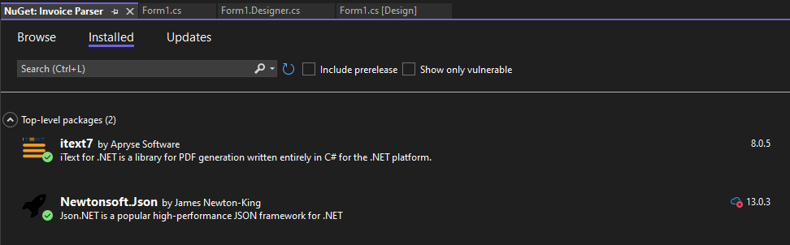

# Invoice Parser Framework

This was a proof of concept **framework for parsing accounting invoices** I created to streamline the process of extracting invoice data such as invoice numbers, customer details, billing addresses, line items, and totals from PDF invoices. The framework provides a simple yet flexible GUI for both drag-and-drop and file browsing options to upload invoices and generate structured JSON files containing parsed invoice data. ***Not fully working yet***

## Features

- **PDF Invoice Parsing**: Automatically extract data such as invoice numbers, customer information, billing address, line items (including item descriptions, quantities, and amounts), and total amounts from accounting invoices.
- **GUI with Drag-and-Drop**: The user-friendly interface allows for intuitive drag-and-drop file uploads, along with a 'Browse Files' button to manually select invoices.
- **JSON Output**: Parsed invoice data is generated and saved as a structured JSON file for further use in accounting systems or data analysis.
- **Customizable Parsing Logic**: Easily extend or customize the parsing logic for different invoice formats by modifying the parsing rules in the code.
- **Multiple Invoice Formats**: Designed to handle different formats of accounting invoices. Future versions will include functionality for adapting to additional invoice structures.


## Requirements

Before running the application, ensure that the following are installed on your system:

- [.NET SDK](https://dotnet.microsoft.com/download) (for building and running the application)
- Visual Studio (or Visual Studio Code) with `.NET Desktop Development` workloads
- **NewtonSoft.json** (for extracting text from PDF invoices)
- **iText7 PDF Library** (for PDF processing)
- Optionally: **Google Document AI** (for more advanced cloud-based parsing)
  
## Installation

To set up the Invoice Parser on your local machine:

1. **Clone the Repository**:
    ```bash
    git clone https://github.com/your-username/invoice-parser-framework.git
    ```
2. **Open in Visual Studio**:
   Open the cloned project in Visual Studio and restore the required NuGet packages.

3. **Install Dependencies**:
   Make sure you have the necessary packages installed, including:
   - `iText7`
   - `Newtonsoft.json`
   - Any additional libraries required for parsing and image processing

4. **Run the Application**:
   Use Visual Studio to build and run the project. The GUI will allow you to either drag-and-drop PDF invoices or browse for files.



## How It Works

1. **Select an Invoice**: Either drag and drop your PDF invoice into the designated area or use the 'Browse Files' button to select it.
2. **Parse the Invoice**: Once the invoice is selected, the application will parse the document and extract the following data:
   - **Invoice Number**
   - **Company Name**
   - **Customer Name**
   - **Billing Address**
   - **Line Items** (Item description, quantity, and amount)
   - **Total Amount / Balance Due**
3. **Generate Output**: The parsed data will be saved in the same directory as the invoice file, formatted as a JSON file.

## Example Output

Here’s a sample of the JSON output generated by the framework:

```json
{
  "InvoiceNumber": "# INV-000001",
  "CompanyName": "Zylker Design Labs",
  "CustomerName": "Jack Little",
  "BillingAddress": "3242 Chandler Hollow Road, Pittsburgh, PA",
  "Items": [
    {
      "ItemNumber": "1",
      "ItemDescription": "Brochure Design",
      "Quantity": "1",
      "Amount": "900.00"
    },
    {
      "ItemNumber": "2",
      "ItemDescription": "Web Design",
      "Quantity": "1",
      "Amount": "7500.00"
    }
  ],
  "BalanceDue": "19,320.00"
}
```
## Contribution

This framework is in its early stages and is designed to be flexible for different invoice formats. Contributions are welcome! If you'd like to contribute:

1. Fork the repository.
2. Create a new branch (`git checkout -b feature-branch`).
3. Commit your changes (`git commit -m 'Add some feature'`).
4. Push to the branch (`git push origin feature-branch`).
5. Open a pull request.

## License

this project is open-source of course so fork it and do whatever you want with it. reinventing the wheel or whatever.
